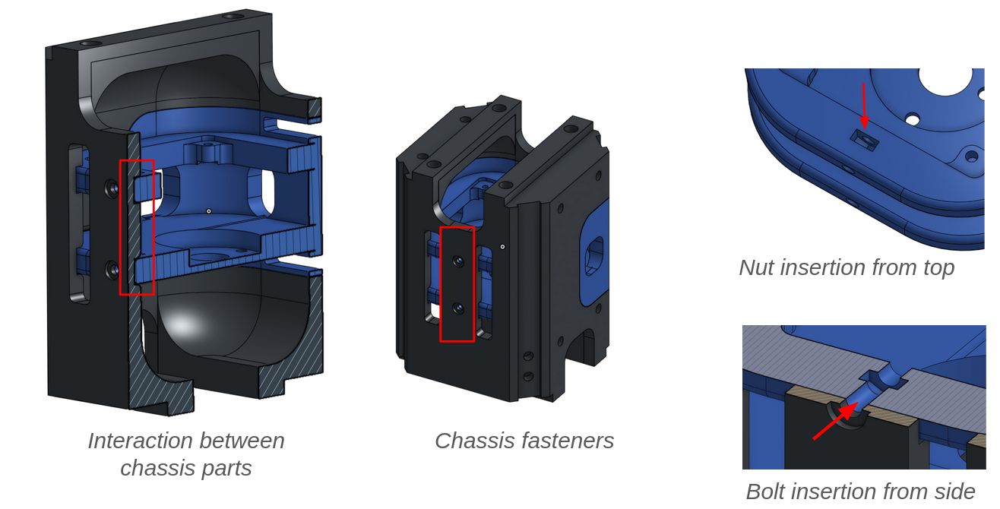

# Capstone: Reaction-Wheel Inverted Pendulum
*Jan. 2024 - Present* 

This prototype is a part of a team Capstone project, in which we are surveying different controls strategies for robots with unstable dynamics. We are mainly comparing the performance of traditional controls methods including using PID controllers, using a Linear-Quadratic Regulator, and using a Model-Predictive Controller, with the performance of neural-network-based controllers, mainly using Reinforcement Learning.

One of the main challenges of this project is characterizing the dynamics of our robot. The video depicts a prototype, but our main robot has a motor in each of the three axes. This brings about highly complex dynamics equations due to phenomona such as gyroscopic procession, and the conservation of angular momentum.

I personally worked on the CAD design of the robot. I created a CAD design that could be 3D printed that had the following benefits from the original: 

- reduced number of parts, easing assembly
- reduced number of fasteners required
- impact loads taken by 3D printed parts, allowing for smaller, lighter fasteners to be used, reducing total mass.

