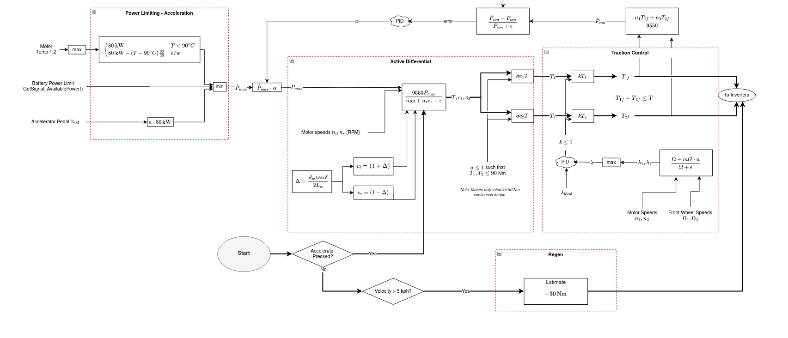
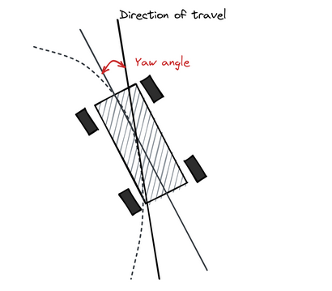
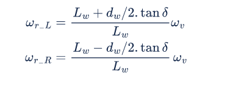

## UBC Formula Electric: Torque Vectoring Drive Algorithm in C 

<text style="color : gray">Ongoing, team project</text>

  

This was a team project in which we developed a drive control algorithm that optimized our lap speeds. It had three main modules: 

1. Power limiting 
2. Software active differential 
3. Traction Control

####  1. Power Limiting Module

The goal of this module was to calculate the absolute most available power to the car at any given point, while taking in safety considerations including the motor temps, battery state of charge, and of course user input. 

#### 2. Software Active Differential 

This module takes in the steering wheel angle as input, and calculates an optimal ratio of left-rear-wheel torque to right-wheel-torque to help get around the corner. 

  

  

From *Draou 2013*, we substitute wheel speeds $\omega_{L,R}$ for torque requests $T_{L,R}$ 

#### 3. Traction Control 

This module's job is to detect when we are slipping and reallocate torques to maximize traction with the ground to stabilize the car. You can think of it as a PID loop that is trying to set the slip ratio of the rear wheels with a value near zero. 
https://1mackenziekyle.github.io/images/IMG_8401.qt
Initially, it seems that zero slipping is the optimal amount for maximum torque transfer, but we found that 5% was the ideal value for this. Interesting. 

## Capstone: Reaction-Wheel Inverted Pendulum

## Robot Summer Project

<iframe width="840" height="470" src="https://www.youtube.com/embed/xE1HmceWWKg" frameborder="0" allowfullscreen></iframe>

*Two DC brushless motors hooked up to an Arduino Nano through an H-Bridge PCB, controlled using two independant PWM pins and a hand-tuned PID controller based on the location of the tape relative to the center of the front of the robot.*

## Cover Letter Generator

<iframe width="840" height="470" src="https://www.youtube.com/embed/SVqlR_FcmrA" frameborder="0" allowfullscreen></iframe>
