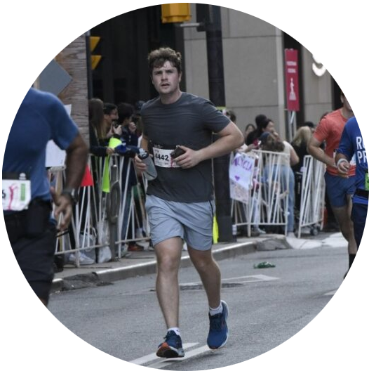

---
# Feel free to add content and custom Front Matter to this file.
# To modify the layout, see https://jekyllrb.com/docs/themes/#overriding-theme-defaults

layout: home
---

&nbsp;

  

&nbsp;

Hi, I'm an Engineering Physics student at UBC. I'm passionate about vehicle controls and embedded systems. I also love running and playing the guitar. Check out my projects! 