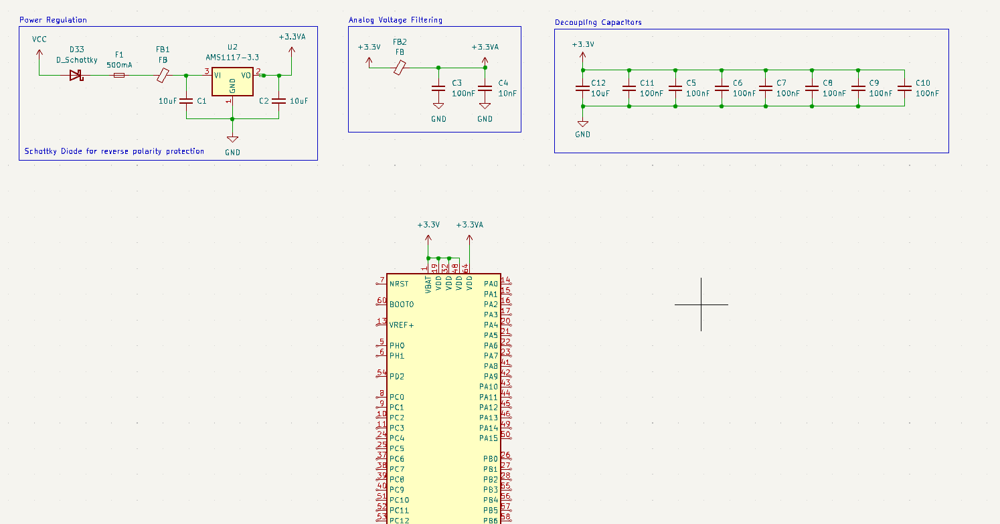

## UBC Formula Electric: Torque Vectoring Drive Algorithm in C 

*Sept. 2023 - Present*

  

The goal of this project was to completely revamp the team's driving algorithm and to improve the car's performance 
in driving events at the FSAE Formula Electric competition. We went into this project looking to utilize the most recent research being done on
electric motor vehicles, and apply our knowledge of control theory to create an algorithm that utilized all the available power the vehicle could deliver in the most efficient way possible for all the different driving events. 

The project was split into three main modules: 

1. Power limiting 
2. Software active differential 
3. Traction Control

####  1. Power Limiting Module

The goal of this module was to calculate the absolute most available power to the car at any given point, while taking in safety considerations including the temperature limits of our motors and inverters, the state of charge of our battery pack, and of course the driver's inputs, e.g. steering wheel angle and accelerator/brake pedal positions. 

#### 2. Software Active Differential 

This module takes in the steering wheel angle as input, and calculates an optimal ratio of left-rear-wheel torque to right-wheel-torque to help get around the corner. 

  

  

From *Draou 2013*, we substitute wheel speeds $\omega_{L,R}$ for torque requests $T_{L,R}$ 

#### 3. Traction Control 

This module's job is to detect when we are slipping and reallocate torques to maximize traction with the ground to stabilize the car. You can think of it as a PID loop that is trying to set the slip ratio of the rear wheels with a value near zero. 

Initially, it seems that zero slipping is the optimal amount for maximum torque transfer, but we found that 5% was the ideal value for this. Interesting. 

---

## Personal Project: Split Keyboard with fully custom firmware and hardware

*July 2024 - Present*

I am actively working on developing my own personal split keyboard. This project will include designing the electrical schematics and PCB for the keyboards, as well as configuring the STM32 chip and writing the code to go on it to work as a fully functional keyboard.

Here is a system-level diagram ...

<object data="./media/sch.pdf" width="800" height="500" type='application/pdf'></object>

---

## Capstone: Reaction-Wheel Inverted Pendulum

<iframe width="384" height="683" src="https://www.youtube.com/embed/-fc4S1K2-TI" title="Reaction Wheel Inverted Pendulum" frameborder="0" allow="accelerometer; autoplay; clipboard-write; encrypted-media; gyroscope; picture-in-picture; web-share" referrerpolicy="strict-origin-when-cross-origin" allowfullscreen></iframe>

---

## Robot Summer Project

*Summer 2022*

<iframe width="1001" height="563" src="https://www.youtube.com/embed/xE1HmceWWKg" title="Robot Summer 2022 Line-Following Prototyping" frameborder="0" allow="accelerometer; autoplay; clipboard-write; encrypted-media; gyroscope; picture-in-picture; web-share" referrerpolicy="strict-origin-when-cross-origin" allowfullscreen></iframe>

*Two DC brushless motors hooked up to an Arduino Nano through an H-Bridge PCB, controlled using two independant PWM pins and a hand-tuned PID controller based on the location of the tape relative to the center of the front of the robot.*

---

## Cover Letter Generator

*March 2022*

<iframe width="1001" height="563" src="https://www.youtube.com/embed/SVqlR_FcmrA" title="Cover Letters Project Demo Video" frameborder="0" allow="accelerometer; autoplay; clipboard-write; encrypted-media; gyroscope; picture-in-picture; web-share" referrerpolicy="strict-origin-when-cross-origin" allowfullscreen></iframe>