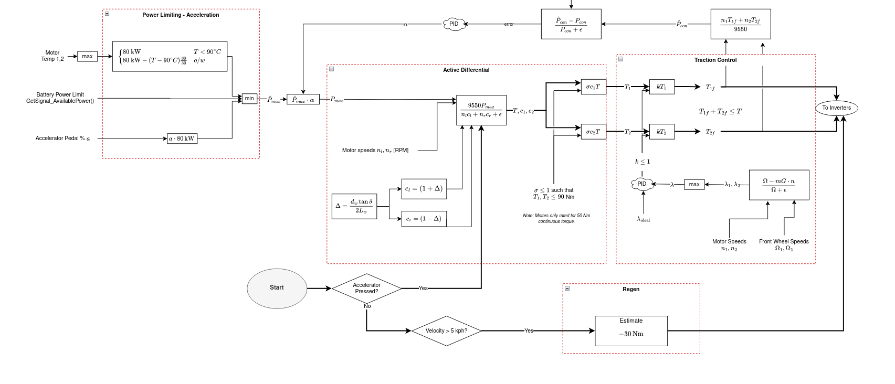
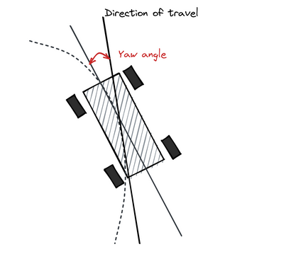
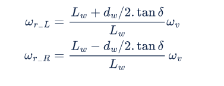

## Quad-motor torque vectoring algorithm 
*Sept. 2024 - Present* 

Researching vehicle modelling and controls algorithms for slip control, yaw rate controllers, and power efficiency modules.

One of the main challenges of this project is getting accurate sensor data, which requires data fusion approaches from multiple sensors. We are currently looking into implementing a complimentary filter using an IMU and GPS, and moving onto an Extended Kalman Filter if the complementary filter does not give satisfactory results. 

## OS161 Operating System 
*Sept. 2024 - Present* 

I am taking an Operating Systems course, in which I am writing OS-level code to add to the educational OS/161 from Harvard's CS161 course. So far,  

#### Synchronization

I used synchronization primitives (namely spinlocks) to implement higher-level primitives to aid in writing concurrent multi-threaded code for a multi-core machine, including higher-level locks, semaphores, and condition variables.

## UBC Formula Electric: Torque Vectoring Drive Algorithm 
*2023 - 2024* 

  

The goal of this project was to completely revamp the team's driving algorithm and to improve the car's performance 
in driving events at the FSAE Formula Electric competition. We went into this project looking to utilize the most recent research being done on
electric motor vehicles, and apply our knowledge of control theory to create an algorithm that utilized all the available power the vehicle could deliver in the most efficient way possible for all the different driving events. 

The project was split into three main modules: 

1. Power limiting 
2. Software active differential 
3. Traction Control

####  1. Power Limiting Module

The goal of this module was to calculate the absolute most available power to the car at any given point, while taking in safety considerations including the temperature limits of our motors and inverters, the state of charge of our battery pack, and of course the driver's inputs, e.g. steering wheel angle and accelerator/brake pedal positions. The limiting factor for power limit is often the battery's state of charge (SOC). We cannot use regenerative braking too much at high SOC, and we can't pull too much power from the battery at low SOC, due to voltage sagging under high discharge currents.

#### 2. Software Active Differential 

This module takes in the steering wheel angle as input, and modulates the left-to-right motor torques to improve the cornering behavior of the car. By applying different torques to each side, we can apply a net moment on the car, causing an angular acceleration in the yaw axis to help us steer around the corner. Additionally, we can take advantage of the traction benefits of the car rolling and causing an increased downforce on the outside wheels of the car.

  

  

From *Draou 2013*, we substitute wheel speeds $\omega_{L,R}$ for torque requests $T_{L,R}$ 

#### 3. Traction Control 

This module's job is to detect when we are slipping and reallocate torques to maximize traction with the ground to stabilize the car. You can think of it as a PID loop that is trying to set the slip ratio of the rear wheels with a value near zero. 

## Personal Project: Split Keyboard with fully custom firmware and hardware
*August 2024 - Present*

I am actively working on developing my own personal split keyboard. This project will include designing the electrical schematics and PCB for the keyboards, as well as configuring the STM32 chip and writing the code to go on it to work as a fully functional keyboard.

Here is a system-level diagram ...

<object data="./media/sch.pdf" width="800" height="500" type='application/pdf'></object>

## Capstone: Reaction-Wheel Inverted Pendulum
*Jan. 2024 - Present* 

This prototype is a part of a team Capstone project, in which we are surveying different controls strategies for robots with unstable dynamics. We are mainly comparing the performance of traditional controls methods including using PID controllers, using a Linear-Quadratic Regulator, and using a Model-Predictive Controller, with the performance of neural-network-based controllers, mainly using Reinforcement Learning.

One of the main challenges of this project is characterizing the dynamics of our robot. The video depicts a prototype, but our main robot has a motor in each of the three axes. This brings about highly complex dynamics equations due to phenomona such as gyroscopic procession, and the conservation of angular momentum.

<iframe width="384" height="683" src="https://www.youtube.com/embed/-fc4S1K2-TI" title="Reaction Wheel Inverted Pendulum" frameborder="0" allow="accelerometer; autoplay; clipboard-write; encrypted-media; gyroscope; picture-in-picture; web-share" referrerpolicy="strict-origin-when-cross-origin" allowfullscreen></iframe>

---

## Robot Summer Project - Summer 2022

<iframe width="1001" height="563" src="https://www.youtube.com/embed/xE1HmceWWKg" title="Robot Summer 2022 Line-Following Prototyping" frameborder="0" allow="accelerometer; autoplay; clipboard-write; encrypted-media; gyroscope; picture-in-picture; web-share" referrerpolicy="strict-origin-when-cross-origin" allowfullscreen></iframe>

*Two DC brushless motors hooked up to an Arduino Nano through an H-Bridge PCB, controlled using two independant PWM pins and a hand-tuned PID controller based on the location of the tape relative to the center of the front of the robot.*

---

## Cover Letter Generator
*March 2022* 

<iframe width="1001" height="563" src="https://www.youtube.com/embed/SVqlR_FcmrA" title="Cover Letters Project Demo Video" frameborder="0" allow="accelerometer; autoplay; clipboard-write; encrypted-media; gyroscope; picture-in-picture; web-share" referrerpolicy="strict-origin-when-cross-origin" allowfullscreen></iframe>

Note: This was no  actually used to apply to any jobs, it was a satire project to utilize the web-scraping skills I learnt at my first co-op term.
